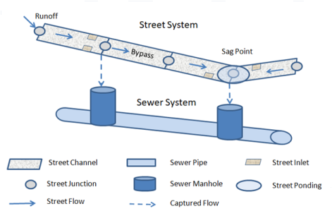
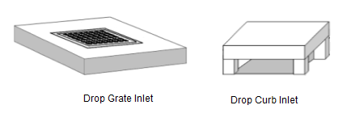
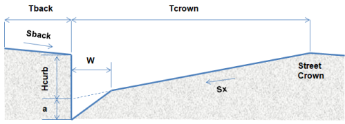
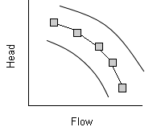

# SWMM 5.2.0 Major Updates

## 1.  HEC-22 Inlet Analysis

SWMM 5 now has the capability to compute the amount of surface runoff flow captured by street inlet structures and sent into a below ground drainage system using the FHWA HEC-22 methodology (see Figure 1). 



Figure 1. Conceptual diagram of a dual drainage system with street inlets

Figure 2 shows the most common types of storm drain inlets used to collect street runoff. While SWMM has some capability to model the capture efficiency of these inlets using its regulator links (orifices, weirs, and outlets), their use for this purpose is not straightforward. Many drainage engineers (and some regulatory agencies) would prefer to use the standard methodology described in the [U.S. Federal Highway Administration�s Urban Drainage Design Manual (HEC-22)](https://www.fhwa.dot.gov/engineering/hydraulics/pubs/10009/10009.pdf).


Figure 2a. Types of Curb & Gutter street inlets

Figure 2b. Types of channel Drop inlets

To implement this feature three new sections have been added to the standard SWMM 5 input file:

 - `[STREETS]` - describes a collection of special street cross-section geometries that can be applied to a project's street conduits
 - `[INLETS]` - defines a set of inlet structures that can be deployed within a project
 - `[INLET_USAGE]` - specifies which conduits contain an inlet structure and the sewer node to which its captured flow is sent.

The format of each section is described in detail below. In addition, a new Street Flow table has been added to SWMM's Status Report that provides the following summary information for each street conduit and inlet after a run has been made:

 - peak flow rate
 - maximum roadway spread
 - maximum roadway flow depth
 - percentage of peak flow rate captured
 - average capture efficiency
 - frequency of bypass flow (i.e., partial capture)
 - frequency of backflow from the sewer system.
 
 Some notable features of how the HEC-22 inlet analysis has been implemented within SWMM are:
 
 - Curb & Gutter inlets can only be used with street conduits while Drop inlets can only be used with trapezoidal channels.
 - Inlets can be used with any of SWMM's flow routing procedures.
 - Proper transfer of pollutants between the street and sewer systems is maintained.
 - Users can stipulate whether an inlet operates on-grade or on-sag or have SWMM decide based on the slopes of the conduits adjoining it.
 - Inlets can have a degree of clogging and a flow capture restriction assigned to them.
 - Multiple inlets of the same design can be assigned to a conduit. For on-grade conditions the flow captured by each inlet is determined sequentially, so that the approach flow to the next inlet in line is the bypass flow from the inlet before it.
 - The flow captured by an inlet is limited by the capacity available in the sewer system to receive it (i.e., the captured flow is reduced so that the sewer node receiving it will not flood).
 - When no flow capacity at an inlet's receiving sewer node is available any excess sewer flow that would cause it to flood is sent back through the inlet and onto the street.
 - For Kinematic Wave and Steady Flow routing it is recommended that storage nodes be used at the end of inlet conduits that converge at sag points since otherwise any non-captured flow will simply exit the system. This is not necessary for Dynamic Wave routing as any non-captured water will create a backwater effect raising water levels in the adjoining conduits.

**Section:**		**[STREETS]**

**Purpose:**		provides the dimensions of street cross sections used within a project.

**Format:**
```
Name  Tcrown  Hcurb  Sx  nRoad  a  W  Sides  Tback  Sback  nBack
```
where
| Parameter |Description  |
|:--|:--|
|`Name` |ID name assigned to street cross section
|`Tcrown`  |distance from curb to street crown (ft or m)
|`Hcurb` |curb height (ft or m)
|`Sx` |street cross slope (%)
|`n` | Manning's n of street surface
|`a` | gutter depression height (in or mm)
|`W` | gutter width (ft or m)
|`Sides` | 1 for single sided street or 2 for two-sided street|
|`Tback` | street backing width (ft or m) |
| `Sback` | street backing slope (%) |
| `nBack` | street backing Manning's n



**Remarks:**

 1. Use one line for each unique street cross section.
 2. If the street has no depressed gutter (`a` = 0) then the gutter width entry is ignored.
 3. If the street has no backing then the three backing parameters can be left out.
 4. To apply a particular street cross section to a conduit add a line to the `[XSECTIONS]` section that includes the conduit's ID name, the keyword `STREET`, and the ID name of the street cross section to be used.
 5. Street cross sections can be used in any SWMM model whether or not any inlets are included.
 
**Section:**		**[INLETS]**

**Purpose:**		defines inlet structure designs that can be used within a project.

**Formats:**
```
Name  GRATE    Length  Width   Type  (Aopen  Vsplash)
Name  CURB     Length  Height  Throat
Name  SLOTTED  Length  Width
Name  CUSTOM   GradeCurve (SagCurve)
```
where
|Parameter |Description  |
|:--|:--|
|`Name` |ID name assigned to an inlet structure
|`Length` | length of the inlet parallel to the street curb (ft or m)
|`Width` | width of a GRATE or SLOTTED inlet (ft or m)
|`Height` | height of a CURB opening inlet (ft or m)
|`Type` | type of GRATE used (see below)
|`Aopen` | fraction of a GENERIC grate's area that is open
|`Vsplash` | splash over velocity for a GENERIC grate (ft/s or m/s)
|`Throat` | the throat angle of a CURB opening inlet (`HORIZONTAL`,`INCLINED` or `VERTICAL`) 
|`GradeCurve` |name of a Diversion-type curve (captured flow v. approach flow) for a CUSTOM inlet operating on-grade
|`SagCurve` | name of a Rating-type curve (captured flow v. water depth) for a CUSTOM inlet operating on-sag|

**Remarks:**

 1. Use one line for each inlet design except as noted below.
 2. For a combination inlet, use one line to describe its grated inlet and a second (with the same ID name) to describe its curb opening inlet.
 3. Grate types can be any of the following:
 
|Grate Type|Description  |
|:--|:--|
| `P_BAR-50` |Parallel bar grate with bar spacing 1-7/8-in on center
|`P_BAR-50x100` | Parallel bar grate with bar spacing 1-7/8-in on center and 3/8-in diameter lateral rods spaced at 4-in on center
|`P_BAR-30` |Parallel bar grate with 1-1/8-in on center bar spacing
|`CURVED_VANE` |Curved vane grate with 3-1/4-in longitudinal bar and 4-1/4-in transverse bar spacing on center
|`TILT_BAR-45` |45 degree tilt bar grate with 2-1/4-in longitudinal bar and 4-in transverse bar spacing on center
|`TILT_BAR-30` |30 degree tilt bar grate with 3-1/4-in and 4-in on center longitudinal and lateral bar spacing respectively
|`RETICULINE` |"Honeycomb" pattern of lateral bars and longitudinal bearing bars
|`GENERIC` |A generic grate whose `Aopen` and `Vsplash` values are provided by the user.

 4. Only a `GENERIC` type grate requires that `Aopen` and `Vsplash` values be provided. The other standard grate types have predetermined values of these parameters. (Splash over velocity is the minimum velocity that will cause some water to shoot over the inlet thus reducing its capture efficiency).
 5. If only one capture curve is supplied for a CUSTOM inlet then it is used for both on-grade and on-sag inlet placements.

**Examples:**
```
; A 2-ft x 2-ft parallel bar grate
  InletType1  GRATE  2  2  P-BAR-30

; A combination inlet
  InletType2  GRATE  2  2  CURVED_VANE
  InletType2  CURB   4  0.5  HORIZONTAL

; A custom inlet using Curve1 as its capture curve
  InletType3  CUSTOM  Curve1
``` 

**Section:**		**[INLET_USAGE]**

**Purpose:**		Assigns inlet structures to specific street conduits.

**Format:**
```
Link  Inlet  Node  (Number  %Clogged  Qmax  aLocal  wLocal  Placement)
```
where
|Parameter  |Description  |
|:--|:--|
|`Link` |name of street conduit containing the inlet
|`Inlet` |name of inlet structure to place in street
|`Node` | name of sewer node receiving flow intercepted by inlet
|`Number` |number of inlets placed on each side of street
|`%Clogged` |degree to which inlet capacity is reduced due to clogging (%)
|`Qmax` | maximum flow that inlet can intercept (flow units)
|`aLocal` | height of local gutter depression (in or mm)
|`wLocal` | width of local gutter depression (ft or m) |
| `Placement` | `AUTOMATIC`, `ON_GRADE`, or `ON_SAG`

**Remarks:**

 1. Only conduits with a STREET cross section can be assigned a Curb & Gutter inlet while Drop inlets can only be assigned to conduits with a TRAPEZOIDAL cross section.
 2. Only the first three parameters are required. The default number of inlets is 1 while the remaining parameters have default values of 0.
 3. A `Qmax` value of 0 indicates that the inlet has no flow restriction.
 4. The local gutter depression applies only over the length of the inlet unlike the continuous depression for a STREET cross section which exists over the full curb length.
 5. The default inlet placement is `AUTOMATIC`, meaning that the program uses the street network topography to determine whether an inlet operates on-grade or on-sag.
 6. There is no requirement that the rim elevation of the receptor sewer node equal the invert elevation of the street node.

## 2.  New Storage Unit Shapes

Two new functional types of surface area v. depth curves have been added to represent the following shaped storage units:
 - **Conical** (truncated elliptical cone):  with surface area equation:
```
Area = PI * (L*W/4 + W*Z*Depth + (W/L)*(Z*Depth)^2)
```
where L = base major axis length, W = base minor axis width and Z = side slope (run/rise).
 - **Pyramidal** (truncated rectangular pyramid):  with surface area equation:
```
Area = L*W + (L+W)*Z*Depth + (2*Z*Depth)^2
```
where L = base length, W = base width and Z = side slope (run/rise).
The format of the `STORAGE` section of the input file used to select these alternatives is:
```
[STORAGE]
node  elev  maxDepth  initDepth  CONICAL    L  W  Z  0 fEvap (infil)
node  elev  maxDepth  initDepth  PYRAMIDAL  L  W  Z  0 fEvap (infil)
```
where
|Parameter  |Description  |
|:--|:--|
|`node` |name of a storage node
|`elev` |elevation of the node's invert
|`maxDepth` | maximum height of stored water in the unit
|`initDepth` |initial height of stored water in the unit
|`L` |length of the longer side of the base of the unit
|`W` |length of the shorter side of the base of the unit
|`Z` |side slope of the unit (run/rise)
|`fEvap` |fraction of potential evaporation realized |
|`infil` |optional set of infiltration parameters

## 3.  Variable Speed Pumps

A new **Type5** pump curve has been introduced to represent a variable speed pump. The curve itself specifies how the pump head decreases with increasing flow (same as a Type3 pump) at some nominal speed which represents a setting of 1.0. At any other speed setting `S` (as adjusted by control rules) a point with head `H` and flow `Q` on the curve becomes `H*S^2` and `Q*S`, respectively on a speed-adjusted curve.
\

\
To define a Type5 pump curve add the following line to the `[CURVES]` section of the input file
```
[CURVES]
name  TYPE5
```
followed by lines containing `name  flow head` values for specific points on the nominal curve.


## 4.  New Control Rule Features
\
*Additional Condition Clause Attributes* 

The following additional attributes have been added to those that can appear in the condition clause of a control rule:
|Object  |Attribute  |Description
|:--|:--|:--
|Rain Gage |`INTENSITY` |rainfall intensity at the current time period
|Rain Gage |`n-HR_DEPTH` | rainfall depth over the past n (1 to 24) hours
|Node | `MAXDEPTH` |node's rim or ground elevation minus its invert elevation
|Node | `INFLOW` |node's current lateral (external) inflow
|Conduit |`FULLFLOW` | Manning flow rate when conduit is full
|Conduit | `FULLDEPTH` | flow depth when conduit is full
|Conduit | `LENGTH` | conduit length
|Conduit | `SLOPE` | conduit slope
|Conduit | `VELOCITY` | flow velocity

*Named Variables*

Named variables  are aliases used to represent the triplet of `<object type | object name | object attribute>` (or a doublet for Simulation times) that appear in the condition clauses of control rules. They allow condition clauses to be written as:
```
variable relation value
variable relation variable
```
where `variable` is defined on a separate line before its first use in a rule using the format:
```
VARIABLE name = object id attribute
```
Here is an example of using this feature:
```
[RULES]
VARIABLE Dabc = NODE abc DEPTH
VARIABLE Defg = NODE efg DEPTH
VARIABLE P45 = PUMP 45 STATUS

RULE 1
IF Dabc > Defg
AND P45 = OFF
THEN PUMP 45 STATUS = ON

RULE 2
IF Dabc < 1
THEN PUMP 45 STATUS = OFF
```
Aside from saving some typing, named variables are required when using arithmetic expressions in rule condition clauses as described next.
\
*Arithmetic Expressions*

In addition to a simple condition placed on a single variable, a control condition clause can now also contain an arithmetic expression formed from several variables whose value is compared against. Thus the format of a condition clause has been extended as follows:
```
expression relation value
expression relation variable
```
where `expression` is defined on a separate line before its first use in a rule using the format:
```
EXPRESSION name = f(variable1, variable2, ...)
```
The function `f(...)` can be any well-formed mathematical expression containing one or more named variables and any of the same math operators and functions that can be used in a groundwater flow equation or a pollutant treatment function. Here is an example of using this feature:
```
[RULES]
VARIABLE Q1 = LINK 1 FLOW
VARIABLE Q2 = LINK 2 FLOW
VARIABLE Q3 = Link 3 FLOW
EXPRESSION Net_Inflow = (Q1 + Q2)/2 - Q3

RULE 1
IF Net_Inflow > 0.1
THEN ORIFICE 3 SETTING = 1
ELSE ORIFICE 3 SETTING = 0.5
```

